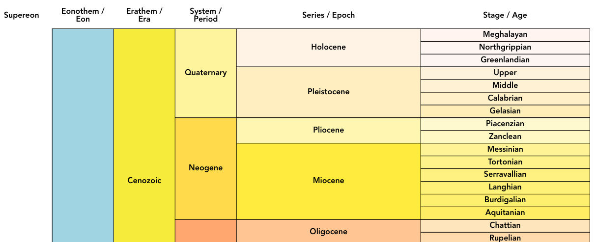

# Interactive Geological Timescale
This repository contains a single page web application that is an interactive rendering of the [International Commission on Stratigraphy](http://www.stratigraphy.org)'s [International Chronostratigraphic Chart](http://www.stratigraphy.org/index.php/ics-chart-timescale).

This application presents a familar view of the geologic timescale drawn from oldest at the bottom to youngest at the top, as per Figure 1.


**Figure 1**: A screenshot of this application

When any time period is clicked by a user, information about that period is retrieved from the [Semantic Web](https://www.w3.org/standards/semanticweb/) delivery of the 2018 version of the Geological Timescale online at:

* **<http://resource.geosciml.org/vocabulary/timescale/gts2018>**


## Example Deployment
You can see this application online at **<https://kurrawong.net/timescale/>**


## Technical details
This is a [vue.js](https://vuejs.org/) application, built using [node.js](https://nodejs.org/en/).

#### Project setup
Download this repository then:
```
npm install
```

##### Compile and hot-reloads for development
```
npm run serve
```

##### Compile and minify for production
Produces a `dist/` folder that can be deployed on a standard webserver (HTML, JS & CSS only).
```
npm run build
```

##### Run your tests
```
npm run test
```

##### Lints and fixes files
```
npm run lint
```

## Rights and License
The content of the Geological Timescale is copyrighted and licensed as per the content delivery at <http://resource.geosciml.org/vocabulary/timescale/gts2018>.

All code and other information in this repository is &copy; CSIRO, 2019 and available for use under the [GNU General Public License, v3](https://www.gnu.org/licenses/gpl-3.0.en.html) (also see [LICENSE](LICENSE) in this repostory for a copy of the deed).


## Contacts
Developer:  
**Jake Hashim-Jones**  
*Junior Informatics Developer*  
CSIRO LAnd & Water, Environmental Informatics Group  
<jake.hashim-jones@csiro.au>  
